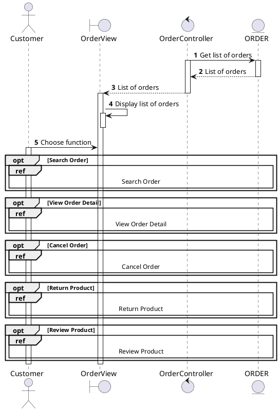

# Sequence View Orders

```plantuml
@startuml
autonumber

actor Customer as C
boundary OrderView as OV
control OrderController as OC
entity ORDER as O

OC -> O: Get list of orders
activate OC
activate O
OC <-- O: List of orders
deactivate O
OV <-- OC: List of orders
deactivate OC
activate OV
OV -> OV: Display list of orders
activate OV
deactivate OV

C -> OV: Choose function
activate C

opt Search Order
  ref over C, O: Search Order
end

opt View Order Detail
  ref over C, O: View Order Detail
end

opt Cancel Order
  ref over C, O: Cancel Order
end

opt Return Product
  ref over C, O: Return Product
end

opt Review Product
  ref over C, O: Review Product
end

deactivate OV
deactivate C
@enduml
```

<!-- diagram id="sequence-view-order-view-order" -->
