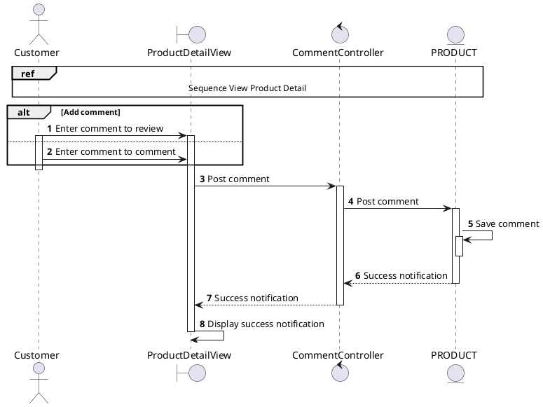

# Sequence Add Comment to Review

```plantuml
@startuml
autonumber

actor Customer as C
boundary ProductDetailView as PDV
control CommentController as CC
entity PRODUCT as P

ref over C, P: Sequence View Product Detail
alt Add comment
  C -> PDV: Enter comment to review
  activate C
  activate PDV
else
  C -> PDV: Enter comment to comment
end
deactivate C
PDV -> CC: Post comment
activate CC
CC -> P: Post comment
activate P
P -> P: Save comment
activate P
deactivate P
CC <-- P: Success notification
deactivate P
PDV <-- CC: Success notification
deactivate CC
PDV -> PDV: Display success notification
deactivate PDV

@enduml
```

<!-- diagram id="sequence-view-product-add-comment-to-review" -->
