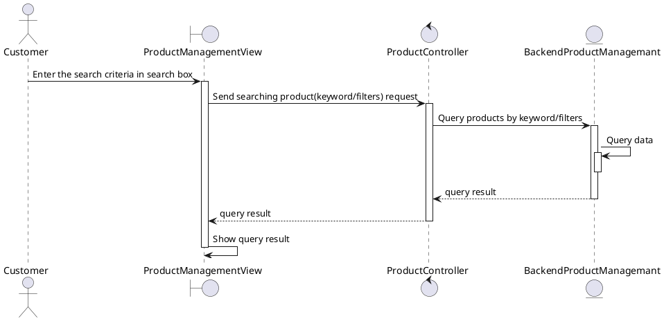

# Search product

```plantuml
@startuml
actor Customer as C
boundary ProductManagementView as PMV
control ProductController as PC
entity BackendProductManagemant as BPM

C -> PMV: Enter the search criteria in search box
activate PMV
PMV -> PC: Send searching product(keyword/filters) request
activate PC
PC -> BPM: Query products by keyword/filters
activate BPM
BPM -> BPM: Query data
activate BPM
deactivate BPM
PC <-- BPM: query result
deactivate BPM
PMV <--PC: query result
deactivate PC

PMV ->PMV: Show query result
deactivate PMV
@enduml
```
