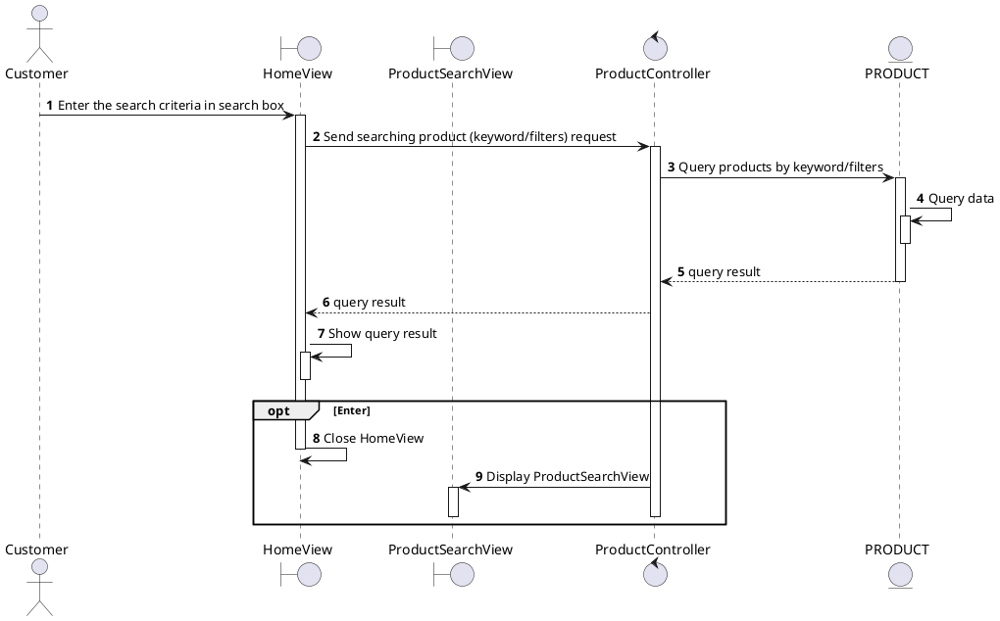

# Search product

```plantuml
@startuml
autonumber

actor Customer as C
boundary HomeView as HV
boundary ProductSearchView as PSV
control ProductController as PC
entity PRODUCT as P

C -> HV: Enter the search criteria in search box
activate HV
HV -> PC: Send searching product (keyword/filters) request
activate PC
PC -> P: Query products by keyword/filters
activate P
P -> P: Query data
activate P
deactivate P
PC <-- P: query result
deactivate P
HV <-- PC: query result
HV -> HV: Show query result
activate HV
deactivate HV

opt Enter
  HV -> HV: Close HomeView
  deactivate HV
  PSV <- PC: Display ProductSearchView
  activate PSV
  deactivate PC
  deactivate PSV
end

@enduml
```

<!-- diagram id="sequence-search-product-search-product" -->
