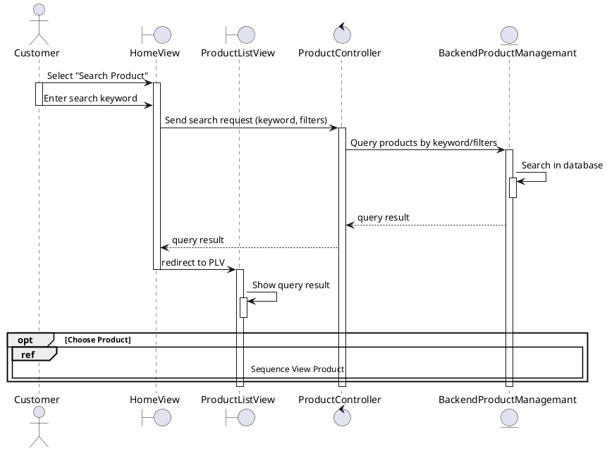

# Search product

```plantuml
@startuml
actor Customer as C
boundary HomeView as HV
boundary ProductListView as PLV
control ProductController as PC
entity BackendProductManagemant as BPM

C -> HV: Select "Search Product"
activate C
activate HV
C -> HV: Enter search keyword
deactivate C

HV -> PC: Send search request (keyword, filters)

activate PC

PC -> BPM: Query products by keyword/filters
activate BPM
BPM -> BPM: Search in database
activate BPM
deactivate BPM
PC <-- BPM: query result
HV <--PC: query result

HV -> PLV: redirect to PLV
deactivate HV
activate PLV
PLV ->PLV: Show query result
activate PLV
deactivate PLV

opt Choose Product
  ref over C, BPM : Sequence View Product
end
deactivate PLV
deactivate PC
deactivate BPM

@enduml
```
