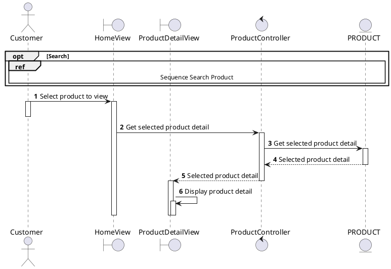

# Sequence View Product Detail

```plantuml
@startuml
autonumber

actor Customer as C
boundary HomeView as HV
boundary ProductDetailView as PDV
control ProductController as PC
entity PRODUCT as P

opt Search
  ref over C, P: Sequence Search Product
end
C -> HV: Select product to view
activate C
activate HV
deactivate C
HV -> PC: Get selected product detail
activate PC
PC -> P: Get selected product detail
activate P
PC <-- P: Selected product detail
deactivate P
PDV <-- PC: Selected product detail
deactivate PC
activate PDV
PDV -> PDV: Display product detail
activate PDV
deactivate PDV
deactivate PDV
deactivate HV

@enduml
```

<!-- diagram id="sequence-view-product-view-product-detail" -->
