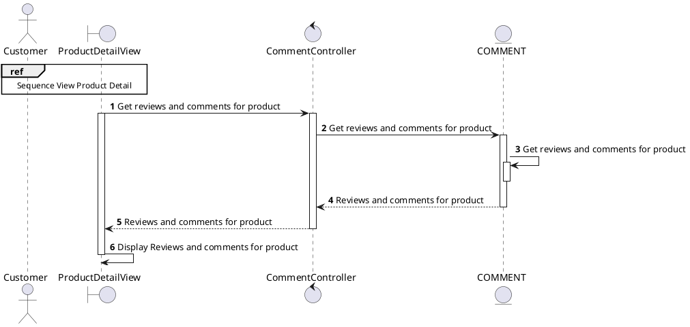

# Sequence View Product Reviews and Comments

```plantuml
@startuml
autonumber

actor Customer as C
boundary ProductDetailView as PDV
control CommentController as CC
entity COMMENT as Co

ref over C, PDV: Sequence View Product Detail
PDV -> CC: Get reviews and comments for product
activate PDV
activate CC
CC -> Co: Get reviews and comments for product
activate Co
Co -> Co: Get reviews and comments for product
activate Co
deactivate Co
CC <-- Co: Reviews and comments for product
deactivate Co
PDV <-- CC: Reviews and comments for product
deactivate CC
PDV -> PDV: Display Reviews and comments for product
deactivate PDV

@enduml
```

<!-- diagram id="sequence-view-product-view-product-reviews-and-comments" -->
