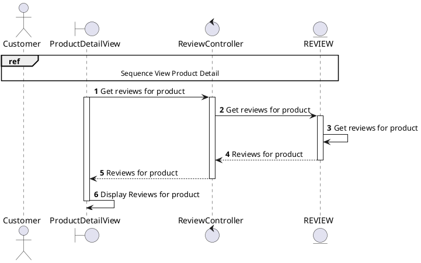

# Sequence View Product Reviews

```plantuml
@startuml
autonumber

actor Customer as C
boundary ProductDetailView as PDV
control ReviewController as RC
entity REVIEW as R

ref over C, R: Sequence View Product Detail
PDV -> RC: Get reviews for product
activate PDV
activate RC
RC -> R: Get reviews for product
activate R
R -> R: Get reviews for product
RC <-- R: Reviews for product
deactivate R
PDV <-- RC: Reviews for product
deactivate RC
PDV -> PDV: Display Reviews for product
deactivate PDV

@enduml
```

<!-- diagram id="sequence-view-product-view-product-reviews" -->
