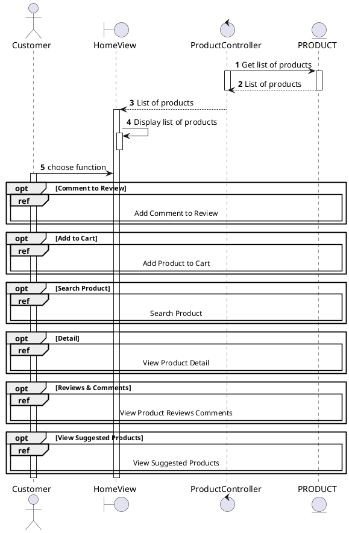

# Sequence View Product

```plantuml
@startuml
autonumber

actor Customer as C
boundary HomeView as HV
control ProductController as PC
entity PRODUCT as P

PC -> P: Get list of products
activate PC
activate P
PC <-- P: List of products
deactivate P
deactivate PC

HV <-- PC: List of products
activate HV
HV -> HV: Display list of products
activate HV
deactivate HV

C -> HV: choose function
activate C

opt Comment to Review
  ref over C, P: Add Comment to Review
end

opt Add to Cart
  ref over C, P: Add Product to Cart
end

opt Search Product
  ref over C, P: Search Product
end

opt Detail
  ref over C, P: View Product Detail
end

opt Reviews & Comments
  ref over C, P: View Product Reviews Comments
end

opt View Suggested Products
  ref over C, P: View Suggested Products
end

deactivate HV
deactivate C

@enduml
```

<!-- diagram id="sequence-view-product-view-product" -->
