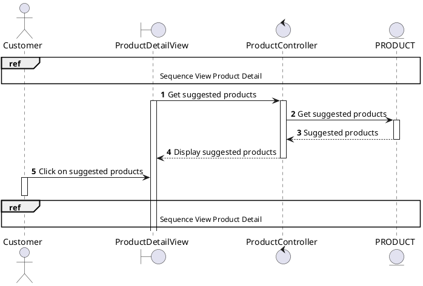

# Sequence View Suggested Product

```plantuml
@startuml
autonumber

actor Customer as C
boundary ProductDetailView as PDV
control ProductController as PC
entity PRODUCT as P

ref over C, P: Sequence View Product Detail
PDV -> PC: Get suggested products
activate PDV
activate PC
PC -> P: Get suggested products
activate P
PC <-- P: Suggested products
deactivate P
PDV <-- PC: Display suggested products
deactivate PC
C -> PDV: Click on suggested products
activate C
deactivate C
ref over C, P: Sequence View Product Detail

@enduml
```

<!-- diagram id="sequence-view-product-view-suggested-product" -->
