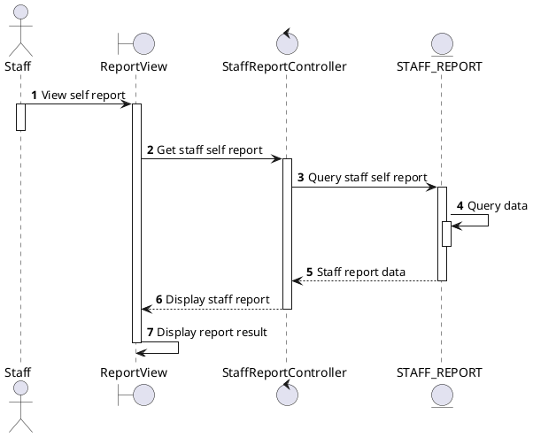

# Sequence View Staff Self Report

```plantuml
@startuml
autonumber

actor Staff as S
boundary ReportView as RV
control StaffReportController as SRC
entity STAFF_REPORT as SR

S -> RV: View self report
activate S
deactivate S
activate RV
RV -> SRC: Get staff self report
activate SRC
SRC -> SR: Query staff self report
activate SR
SR -> SR: Query data
activate SR
deactivate SR
SRC <-- SR: Staff report data
deactivate SR
RV <-- SRC: Display staff report
deactivate SRC
RV -> RV: Display report result
deactivate RV

@enduml
```

<!-- diagram id="sequence-view-staff-self-report-view-staff-self-report" -->
