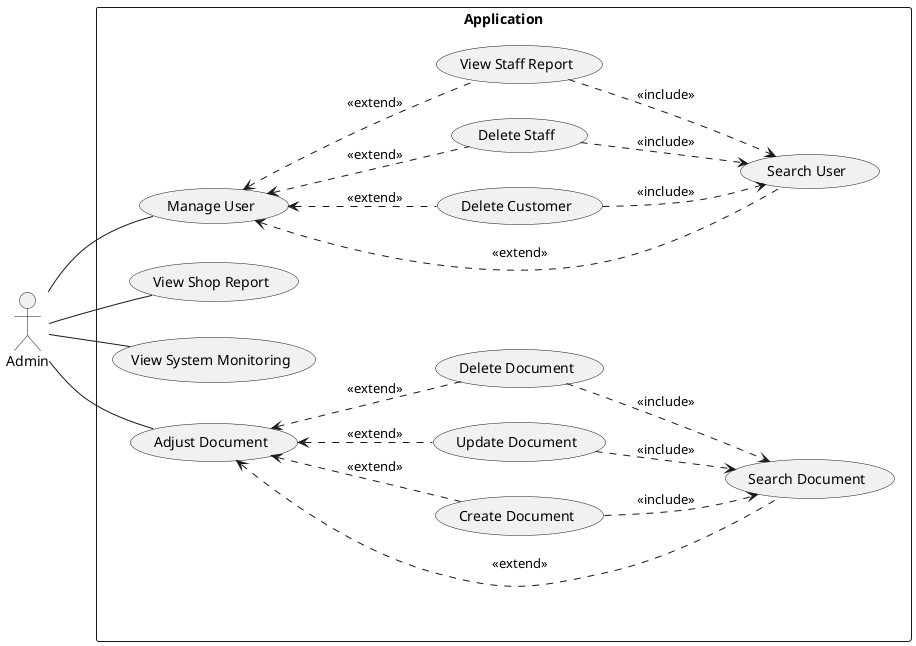

# Use Case Admin

```plantuml
@startuml
left to right direction
actor Admin

rectangle "Application" {
  usecase UC01 as "Manage User"
  usecase UC02 as "Search User"
  usecase UC03 as "Delete Customer"
  usecase UC04 as "Delete Staff"
  usecase UC05 as "View Staff Report"
  usecase UC06 as "View Shop Report"
  usecase UC07 as "View System Monitoring"
  usecase UC08 as "Adjust Document"
  usecase UC09 as "Search Document"
  usecase UC10 as "Create Document"
  usecase UC11 as "Update Document"
  usecase UC12 as "Delete Document"
}

Admin -- UC01
Admin -- UC06
Admin -- UC07
Admin -- UC08

UC01 <.. UC02 : <<extend>>
UC01 <.. UC03 : <<extend>>
UC01 <.. UC04 : <<extend>>
UC01 <.. UC05 : <<extend>>
UC03 ..> UC02 : <<include>>
UC04 ..> UC02 : <<include>>
UC05 ..> UC02 : <<include>>
UC08 <.. UC09 : <<extend>>
UC08 <.. UC10 : <<extend>>
UC08 <.. UC11 : <<extend>>
UC08 <.. UC12 : <<extend>>
UC10 ..> UC09 : <<include>>
UC11 ..> UC09 : <<include>>
UC12 ..> UC09 : <<include>>

@enduml
```

<!-- diagram id="use-case-admin" -->
