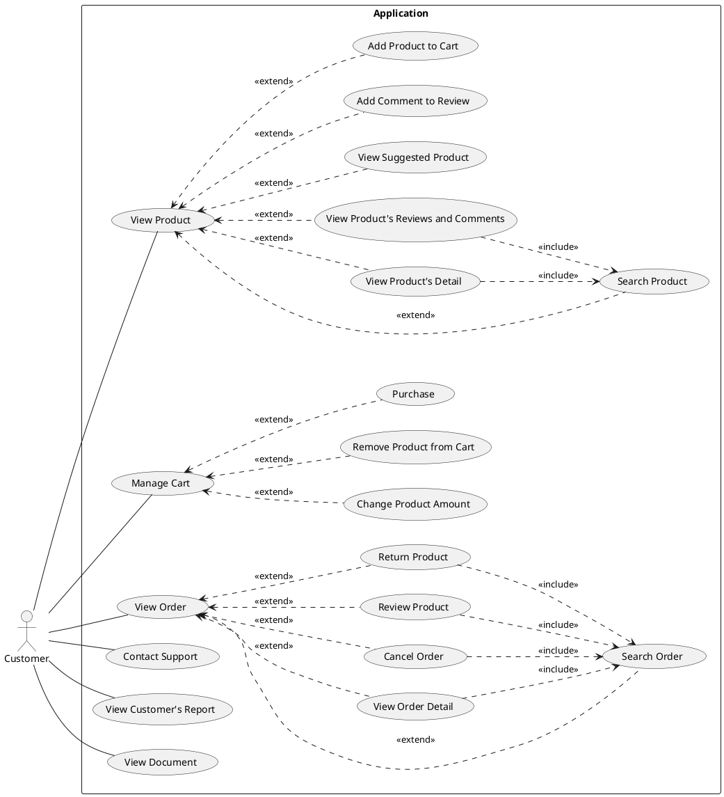

# Use Case Customer

```plantuml
@startuml
left to right direction
actor Customer

rectangle "Application" {
  usecase UC01 as "View Product"
  usecase UC02 as "Search Product"
  usecase UC03 as "View Product's Detail"
  usecase UC04 as "View Product's Reviews and Comments"
  usecase UC05 as "View Suggested Product"
  usecase UC06 as "Add Comment to Review"
  usecase UC07 as "Add Product to Cart"
  usecase UC08 as "Manage Cart"
  usecase UC09 as "Change Product Amount"
  usecase UC10 as "Remove Product from Cart"
  usecase UC11 as "Purchase"
  usecase UC12 as "View Order"
  usecase UC13 as "Search Order"
  usecase UC14 as "View Order Detail"
  usecase UC15 as "Cancel Order"
  usecase UC16 as "Review Product"
  usecase UC17 as "Return Product"
  usecase UC18 as "Contact Support"
  usecase UC19 as "View Customer's Report"
  usecase UC20 as "View Document"
}

Customer -- UC01
Customer -- UC08
Customer -- UC12
Customer -- UC18
Customer -- UC19
Customer -- UC20

UC01 <.. UC02 : <<extend>>
UC01 <.. UC03 : <<extend>>
UC01 <.. UC04 : <<extend>>
UC01 <.. UC05 : <<extend>>
UC01 <.. UC06 : <<extend>>
UC01 <.. UC07 : <<extend>>
UC03 ..> UC02 : <<include>>
UC04 ..> UC02 : <<include>>
UC08 <.. UC09 : <<extend>>
UC08 <.. UC10 : <<extend>>
UC08 <.. UC11 : <<extend>>
UC12 <.. UC13 : <<extend>>
UC12 <.. UC14 : <<extend>>
UC12 <.. UC15 : <<extend>>
UC12 <.. UC16 : <<extend>>
UC12 <.. UC17 : <<extend>>
UC14 ..> UC13 : <<include>>
UC15 ..> UC13 : <<include>>
UC16 ..> UC13 : <<include>>
UC17 ..> UC13 : <<include>>

@enduml
```

<!-- diagram id="usecase-customer" -->
