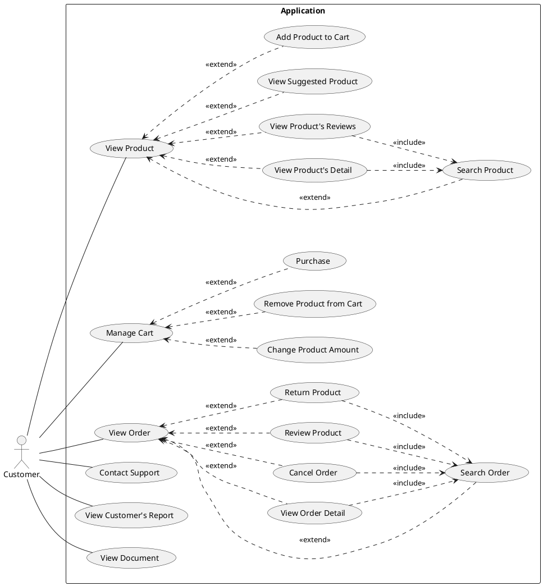

# Use Case Customer

```plantuml
@startuml
left to right direction
actor Customer

rectangle "Application" {
  usecase UC01 as "View Product"
  usecase UC02 as "Search Product"
  usecase UC03 as "View Product's Detail"
  usecase UC04 as "View Product's Reviews"
  usecase UC05 as "View Suggested Product"
  usecase UC06 as "Add Product to Cart"
  usecase UC07 as "Manage Cart"
  usecase UC08 as "Change Product Amount"
  usecase UC09 as "Remove Product from Cart"
  usecase UC10 as "Purchase"
  usecase UC11 as "View Order"
  usecase UC12 as "Search Order"
  usecase UC13 as "View Order Detail"
  usecase UC14 as "Cancel Order"
  usecase UC15 as "Review Product"
  usecase UC16 as "Return Product"
  usecase UC17 as "Contact Support"
  usecase UC18 as "View Customer's Report"
  usecase UC19 as "View Document"
}

Customer -- UC01
Customer -- UC07
Customer -- UC11
Customer -- UC17
Customer -- UC18
Customer -- UC19

UC01 <.. UC02 : <<extend>>
UC01 <.. UC03 : <<extend>>
UC01 <.. UC04 : <<extend>>
UC01 <.. UC05 : <<extend>>
UC01 <.. UC06 : <<extend>>
UC03 ..> UC02 : <<include>>
UC04 ..> UC02 : <<include>>
UC07 <.. UC08 : <<extend>>
UC07 <.. UC09 : <<extend>>
UC07 <.. UC10 : <<extend>>
UC11 <.. UC12 : <<extend>>
UC11 <.. UC13 : <<extend>>
UC11 <.. UC14 : <<extend>>
UC11 <.. UC15 : <<extend>>
UC11 <.. UC16 : <<extend>>
UC13 ..> UC12 : <<include>>
UC14 ..> UC12 : <<include>>
UC15 ..> UC12 : <<include>>
UC16 ..> UC12 : <<include>>

@enduml
```

<!-- diagram id="use-case-customer" -->
