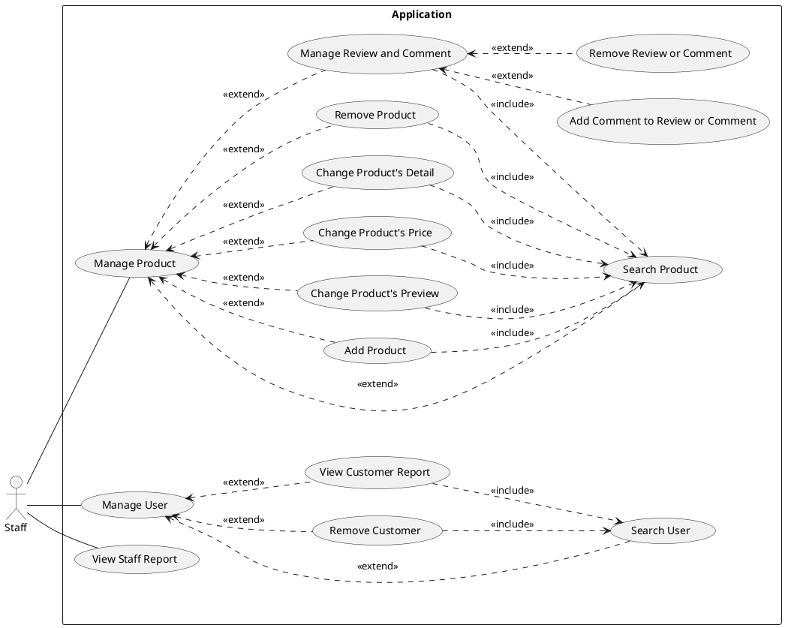

# Use Case Staff

```plantuml
@startuml
left to right direction
actor Staff

rectangle "Application" {
  usecase UC01 as "Manage Product"
  usecase UC02 as "Search Product"
  usecase UC03 as "Add Product"
  usecase UC04 as "Change Product's Preview"
  usecase UC05 as "Change Product's Price"
  usecase UC06 as "Change Product's Detail"
  usecase UC07 as "Remove Product"
  usecase UC08 as "Manage Review and Comment"
  usecase UC09 as "Add Comment to Review or Comment"
  usecase UC10 as "Remove Review or Comment"
  usecase UC11 as "Manage User"
  usecase UC12 as "Search User"
  usecase UC13 as "Remove Customer"
  usecase UC14 as "View Customer Report"
  usecase UC15 as "View Staff Report"
}

Staff -- UC01
Staff -- UC11
Staff -- UC15

UC01 <.. UC02 : <<extend>>
UC01 <.. UC03 : <<extend>>
UC01 <.. UC04 : <<extend>>
UC01 <.. UC05 : <<extend>>
UC01 <.. UC06 : <<extend>>
UC01 <.. UC07 : <<extend>>
UC01 <.. UC08 : <<extend>>
UC03 ..> UC02 : <<include>>
UC04 ..> UC02 : <<include>>
UC05 ..> UC02 : <<include>>
UC06 ..> UC02 : <<include>>
UC07 ..> UC02 : <<include>>
UC08 ..> UC02 : <<include>>
UC08 <.. UC09 : <<extend>>
UC08 <.. UC10 : <<extend>>
UC11 <.. UC12 : <<extend>>
UC11 <.. UC13 : <<extend>>
UC11 <.. UC14 : <<extend>>
UC13 ..> UC12 : <<include>>
UC14 ..> UC12 : <<include>>

@enduml
```

<!-- diagram id="usecase-staff" -->
