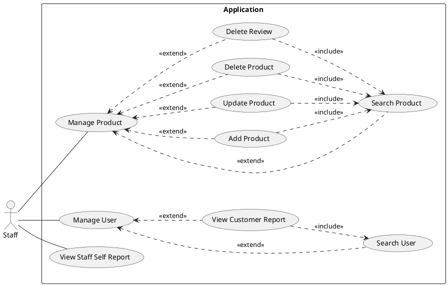

# Use Case Staff

```plantuml
@startuml
left to right direction
actor Staff

rectangle "Application" {
  usecase UC01 as "Manage Product"
  usecase UC02 as "Search Product"
  usecase UC03 as "Add Product"
  usecase UC04 as "Update Product"
  usecase UC05 as "Delete Product"
  usecase UC06 as "Delete Review"
  usecase UC07 as "Manage User"
  usecase UC08 as "Search User"
  usecase UC09 as "View Customer Report"
  usecase UC10 as "View Staff Self Report"
}

Staff -- UC01
Staff -- UC07
Staff -- UC10

UC01 <.. UC02 : <<extend>>
UC01 <.. UC03 : <<extend>>
UC01 <.. UC04 : <<extend>>
UC01 <.. UC05 : <<extend>>
UC01 <.. UC06 : <<extend>>
UC03 ..> UC02 : <<include>>
UC04 ..> UC02 : <<include>>
UC05 ..> UC02 : <<include>>
UC06 ..> UC02 : <<include>>
UC07 <.. UC08 : <<extend>>
UC07 <.. UC09 : <<extend>>
UC09 ..> UC08 : <<include>>

@enduml
```

<!-- diagram id="use-case-staff" -->
