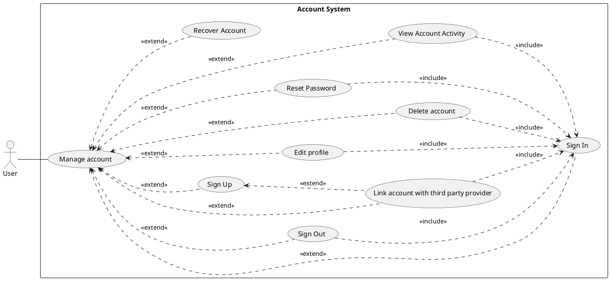

# Use Case User

```plantuml
@startuml
left to right direction
actor User

rectangle "Account System" {
  usecase UC01 as "Manage account"
  usecase UC02 as "Sign Up"
  usecase UC03 as "Sign In"
  usecase UC04 as "Sign Out"
  usecase UC05 as "Edit profile"
  usecase UC06 as "Link account with third party provider"
  usecase UC07 as "Delete account"
  usecase UC08 as "Reset Password"
  usecase UC09 as "View Account Activity"
  usecase UC10 as "Recover Account"
}

User -- UC01

UC01 <.. UC02 : <<extend>>
UC01 <.. UC03 : <<extend>>
UC01 <.. UC04 : <<extend>>
UC01 <.. UC05 : <<extend>>
UC01 <.. UC06 : <<extend>>
UC01 <.. UC07 : <<extend>>
UC01 <.. UC08 : <<extend>>
UC01 <.. UC09 : <<extend>>
UC01 <.. UC10 : <<extend>>
UC02 <.. UC06 : <<extend>>

UC04 ..> UC03 : <<include>>
UC05 ..> UC03 : <<include>>
UC06 ..> UC03 : <<include>>
UC07 ..> UC03 : <<include>>
UC08 ..> UC03 : <<include>>
UC09 ..> UC03 : <<include>>

@enduml
```

<!-- diagram id="use-case-user" -->
