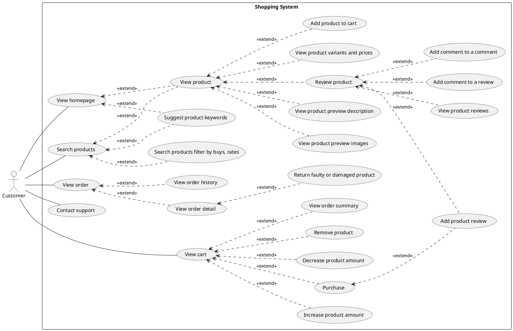

# Customer

```plantuml
@startuml
left to right direction
actor Customer

rectangle "Shopping System" {
  usecase UC01 as "View homepage"
  usecase UC02 as "Search products"
  usecase UC03 as "Search products filter by buys, rates"
  usecase UC04 as "Suggest product keywords"
  usecase UC05 as "View product"
  usecase UC06 as "View product preview images"
  usecase UC07 as "View product preview description"
  usecase UC08 as "View product variants and prices"
  usecase UC09 as "Review product"
  usecase UC10 as "View product reviews"
  usecase UC11 as "Add product review"
  usecase UC12 as "Add comment to a review"
  usecase UC13 as "Add comment to a comment"
  usecase UC14 as "Add product to cart"
  usecase UC15 as "View cart"
  usecase UC16 as "Increase product amount"
  usecase UC17 as "Decrease product amount"
  usecase UC18 as "Remove product"
  usecase UC19 as "View order summary"
  usecase UC20 as "Purchase"
  usecase UC21 as "View order"
  usecase UC22 as "View order history"
  usecase UC23 as "View order detail"
  usecase UC24 as "Contact support"
  usecase UC25 as "Return faulty or damaged product"
}

Customer -- UC01
Customer -- UC02
Customer -- UC15
Customer -- UC21
Customer -- UC24

UC01 <.. UC04 : <<extend>>
UC01 <.. UC05 : <<extend>>
UC02 <.. UC04 : <<extend>>
UC02 <.. UC05 : <<extend>>
UC02 <.. UC03 : <<extend>>
UC05 <.. UC06 : <<extend>>
UC05 <.. UC07 : <<extend>>
UC05 <.. UC08 : <<extend>>
UC05 <.. UC09 : <<extend>>
UC05 <.. UC14 : <<extend>>
UC09 <.. UC10 : <<extend>>
UC09 <.. UC11 : <<extend>>
UC09 <.. UC12 : <<extend>>
UC09 <.. UC13 : <<extend>>
UC15 <.. UC19 : <<extend>>
UC15 <.. UC16 : <<extend>>
UC15 <.. UC17 : <<extend>>
UC15 <.. UC18 : <<extend>>
UC15 <.. UC20 : <<extend>>
UC20 <.. UC11 : <<extend>>
UC21 <.. UC22 : <<extend>>
UC21 <.. UC23 : <<extend>>
UC23 <.. UC25 : <<extend>>

@enduml
```

<!-- diagram id="usecase-customer" -->
