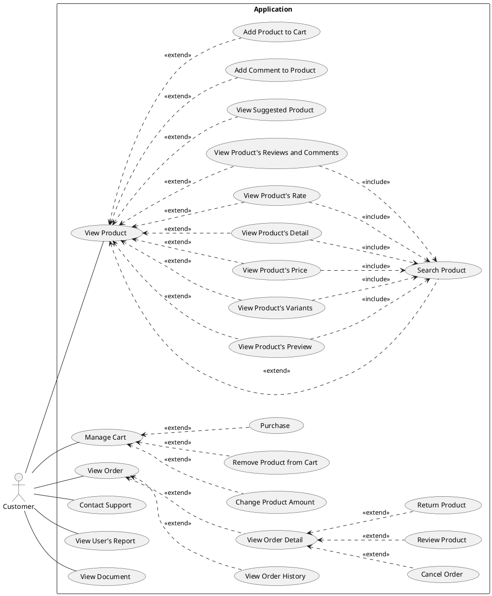

# Customer

```plantuml
@startuml
left to right direction
actor Customer

rectangle "Application" {
  usecase UC01 as "View Product"
  usecase UC02 as "Search Product"
  usecase UC03 as "View Product's Preview"
  usecase UC04 as "View Product's Variants"
  usecase UC05 as "View Product's Price"
  usecase UC06 as "View Product's Detail"
  usecase UC07 as "View Product's Rate"
  usecase UC08 as "View Product's Reviews and Comments"
  usecase UC09 as "View Suggested Product"
  usecase UC10 as "Add Comment to Product"
  usecase UC11 as "Add Product to Cart"
  usecase UC12 as "Manage Cart"
  usecase UC13 as "Change Product Amount"
  usecase UC14 as "Remove Product from Cart"
  usecase UC15 as "Purchase"
  usecase UC16 as "View Order"
  usecase UC17 as "View Order History"
  usecase UC18 as "View Order Detail"
  usecase UC19 as "Cancel Order"
  usecase UC20 as "Review Product"
  usecase UC21 as "Return Product"
  usecase UC22 as "Contact Support"
  usecase UC23 as "View User's Report"
  usecase UC24 as "View Document"
}

Customer -- UC01
Customer -- UC12
Customer -- UC16
Customer -- UC22
Customer -- UC23
Customer -- UC24

UC01 <.. UC02 : <<extend>>
UC01 <.. UC03 : <<extend>>
UC01 <.. UC04 : <<extend>>
UC01 <.. UC05 : <<extend>>
UC01 <.. UC06 : <<extend>>
UC01 <.. UC07 : <<extend>>
UC01 <.. UC08 : <<extend>>
UC01 <.. UC09 : <<extend>>
UC01 <.. UC10 : <<extend>>
UC01 <.. UC11 : <<extend>>
UC03 ..> UC02 : <<include>>
UC04 ..> UC02 : <<include>>
UC05 ..> UC02 : <<include>>
UC06 ..> UC02 : <<include>>
UC07 ..> UC02 : <<include>>
UC08 ..> UC02 : <<include>>
UC12 <.. UC13 : <<extend>>
UC12 <.. UC14 : <<extend>>
UC12 <.. UC15 : <<extend>>
UC16 <.. UC17 : <<extend>>
UC16 <.. UC18 : <<extend>>
UC18 <.. UC19 : <<extend>>
UC18 <.. UC20 : <<extend>>
UC18 <.. UC21 : <<extend>>

@enduml
```
