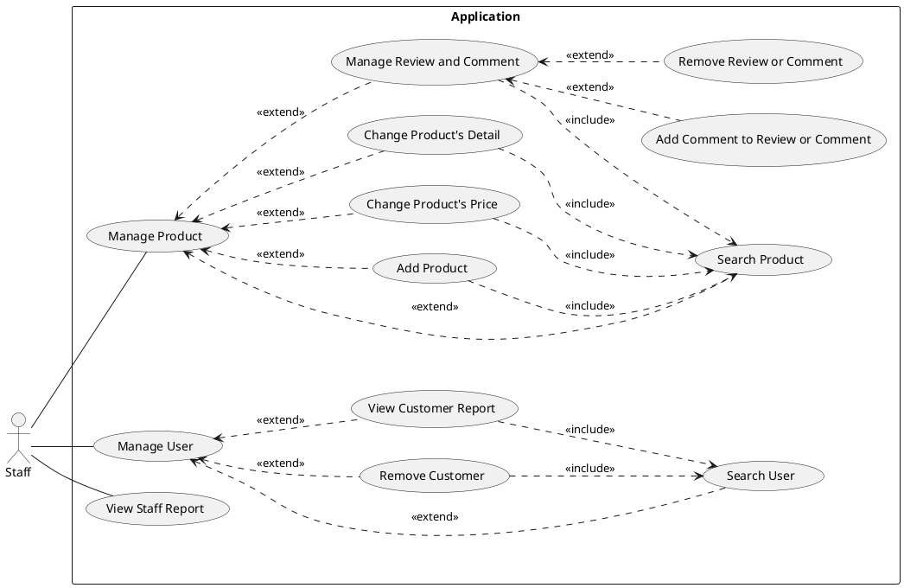

# Staff

```plantuml
@startuml
left to right direction
actor Staff

rectangle "Application" {
  usecase UC01 as "Manage Product"
  usecase UC02 as "Search Product"
  usecase UC03 as "Add Product"
  usecase UC04 as "Change Product's Price"
  usecase UC05 as "Change Product's Detail"
  usecase UC06 as "Manage Review and Comment"
  usecase UC07 as "Add Comment to Review or Comment"
  usecase UC08 as "Remove Review or Comment"
  usecase UC09 as "Manage User"
  usecase UC10 as "Search User"
  usecase UC11 as "Remove Customer"
  usecase UC12 as "View Customer Report"
  usecase UC13 as "View Staff Report"
}

Staff -- UC01
Staff -- UC09
Staff -- UC13

UC01 <.. UC02 : <<extend>>
UC01 <.. UC03 : <<extend>>
UC01 <.. UC04 : <<extend>>
UC01 <.. UC05 : <<extend>>
UC01 <.. UC06 : <<extend>>
UC03 ..> UC02 : <<include>>
UC04 ..> UC02 : <<include>>
UC05 ..> UC02 : <<include>>
UC06 ..> UC02 : <<include>>
UC06 <.. UC07 : <<extend>>
UC06 <.. UC08 : <<extend>>
UC09 <.. UC10 : <<extend>>
UC09 <.. UC11 : <<extend>>
UC09 <.. UC12 : <<extend>>
UC11 ..> UC10 : <<include>>
UC12 ..> UC10 : <<include>>

@enduml
```

<!-- diagram id="usecase-staff" -->
