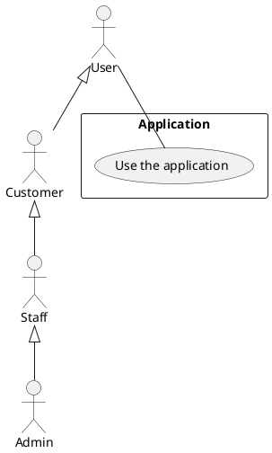
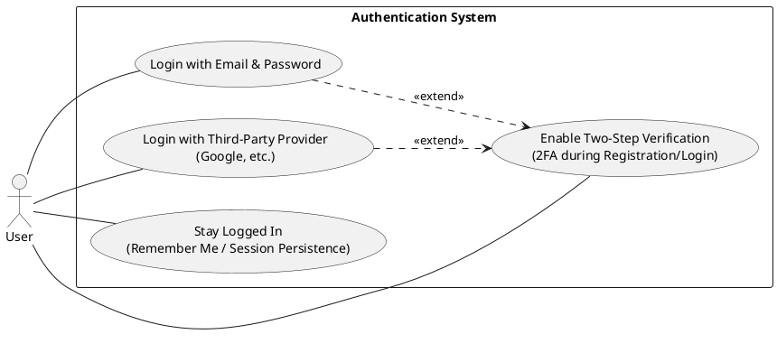

# User

## User and application

```plantuml
@startuml
actor User
actor Customer
actor Staff
actor Admin

User <|-- Customer
Customer <|-- Staff
Staff <|-- Admin

rectangle "Application" {
  usecase UC1 as "Use the application"
}

User -- UC1

@enduml
```

<!-- diagram id="usecase-user-application" -->

## User

```plantuml
@startuml
left to right direction

actor User

rectangle "Authentication System" {
  usecase UC1 as "Login with Email & Password"
  usecase UC2 as "Login with Third-Party Provider\n(Google, etc.)"
  usecase UC3 as "Stay Logged In\n(Remember Me / Session Persistence)"
  usecase UC4 as "Enable Two-Step Verification\n(2FA during Registration/Login)"
}

User -- UC1
User -- UC2
User -- UC3
User -- UC4

UC1 ..> UC4 : <<extend>>
UC2 ..> UC4 : <<extend>>

@enduml
```

<!-- diagram id="usecase-user" -->
