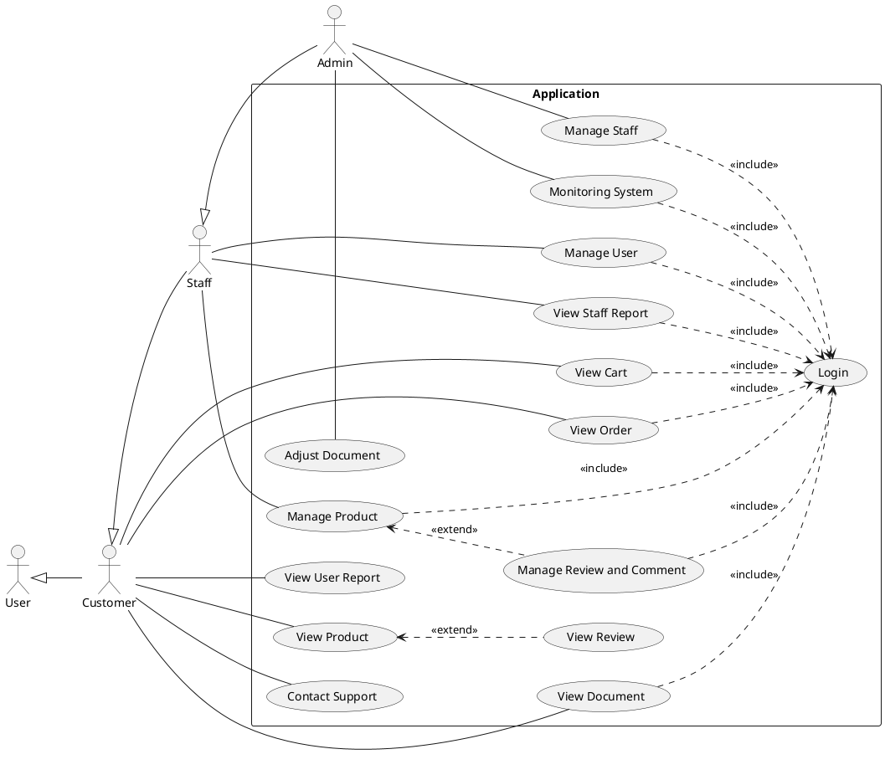
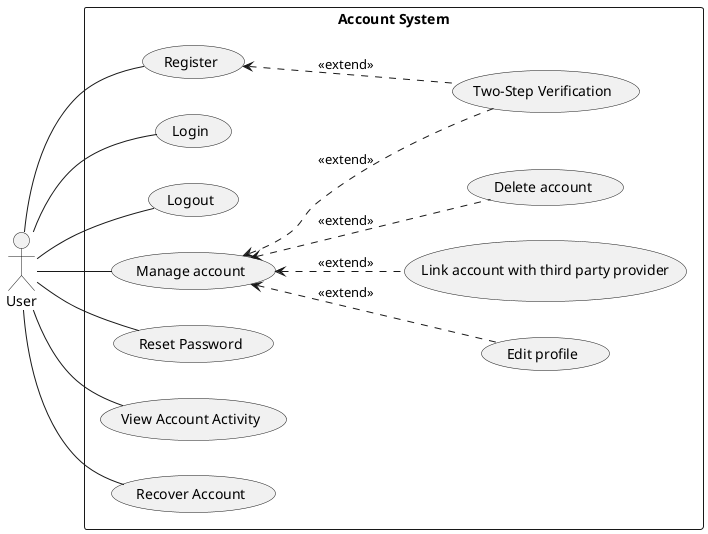

# User

## User and application

```plantuml
@startuml
left to right direction
actor User
actor Customer
actor Staff
actor Admin

User <|-- Customer
Customer <|-- Staff
Staff <|-- Admin

rectangle "Application" {
  usecase UC01 as "Login"
  usecase UC02 as "View Product"
  usecase UC03 as "View Review"
  usecase UC04 as "View Cart"
  usecase UC05 as "View Order"
  usecase UC06 as "Contact Support"
  usecase UC07 as "View User Report"
  usecase UC08 as "View Document"
  usecase UC09 as "Manage Product"
  usecase UC10 as "Manage Review and Comment"
  usecase UC11 as "Manage User"
  usecase UC12 as "View Staff Report"
  usecase UC13 as "Manage Staff"
  usecase UC14 as "Monitoring System"
  usecase UC15 as "Adjust Document"
}

Customer -- UC02
Customer -- UC04
Customer -- UC05
Customer -- UC06
Customer -- UC07
Customer -- UC08
Staff -- UC09
Staff -- UC11
Staff -- UC12
Admin -- UC13
Admin -- UC14
Admin -- UC15

UC02 <.. UC03 : <<extend>>
UC09 <.. UC10 : <<extend>>

UC04 ..> UC01 : <<include>>
UC05 ..> UC01 : <<include>>
UC08 ..> UC01 : <<include>>
UC09 ..> UC01 : <<include>>
UC10 ..> UC01 : <<include>>
UC11 ..> UC01 : <<include>>
UC12 ..> UC01 : <<include>>
UC13 ..> UC01 : <<include>>
UC14 ..> UC01 : <<include>>

@enduml
```

<!-- diagram id="usecase-user-application" -->

## User and account system

```plantuml
@startuml
left to right direction

actor User

rectangle "Account System" {
  usecase UC01 as "Register"
  usecase UC02 as "Login"
  usecase UC03 as "Logout"
  usecase UC04 as "Two-Step Verification"
  usecase UC05 as "Manage account"
  usecase UC06 as "Edit profile"
  usecase UC07 as "Link account with third party provider"
  usecase UC08 as "Delete account"
  usecase UC09 as "Reset Password"
  usecase UC10 as "View Account Activity"
  usecase UC11 as "Recover Account"
}

User -- UC01
User -- UC02
User -- UC03
User -- UC05
User -- UC09
User -- UC10
User -- UC11

UC01 <.. UC04 : <<extend>>
UC05 <.. UC04 : <<extend>>
UC05 <.. UC06 : <<extend>>
UC05 <.. UC07 : <<extend>>
UC05 <.. UC08 : <<extend>>

@enduml
```

<!-- diagram id="usecase-user-account-system" -->
