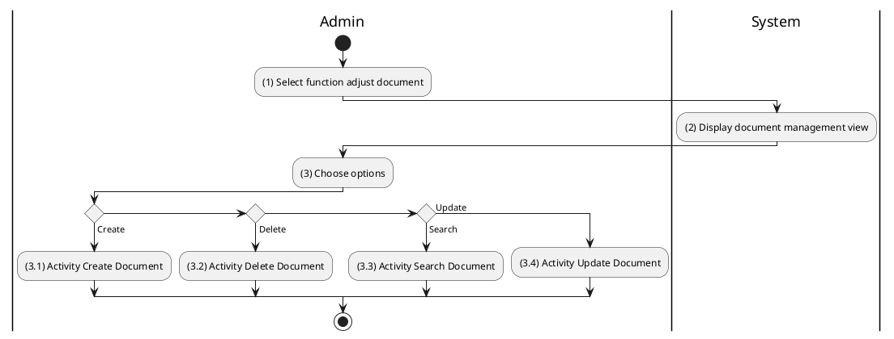

# Activity Adjust Document

```plantuml
@startuml
|A|Admin
|S|System

|A|
start
:(1) Select function adjust document;
|S|
:(2) Display document management view;
|A|
:(3) Choose options;
if () then (Create)
  :(3.1) Activity Create Document;
elseif () then (Delete)
  :(3.2) Activity Delete Document;
elseif () then (Search)
  :(3.3) Activity Search Document;
else (Update)
  :(3.4) Activity Update Document;
endif
|A|
stop
@enduml
```

<!-- diagram id="activity-adjust-document-adjust-document" -->
