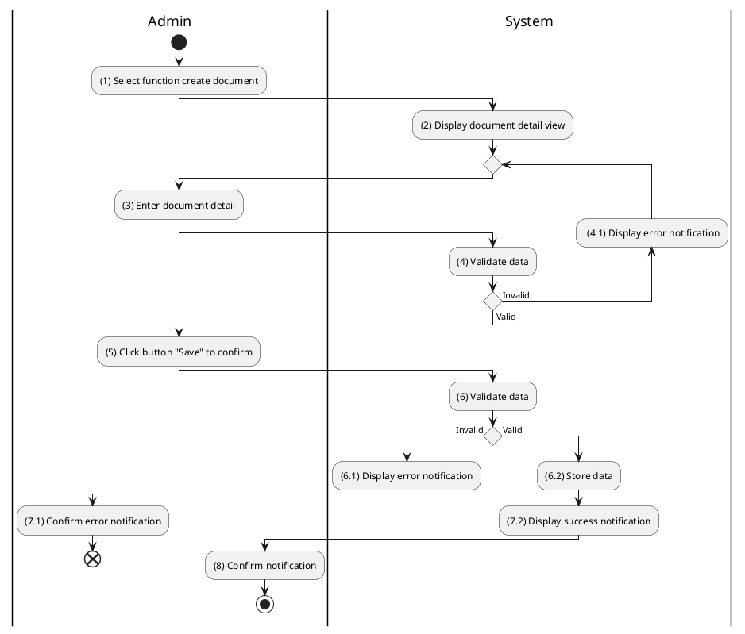

# Activity Create Document

```plantuml
@startuml
|A|Admin
|S|System

|A|
start
:(1) Select function create document;
|S|
:(2) Display document detail view;
repeat
  |A|
  :(3) Enter document detail;
  |S|
  :(4) Validate data;
backward: (4.1) Display error notification;
repeat while () is (Invalid) not (Valid)
|A|
:(5) Click button "Save" to confirm;
|S|
:(6) Validate data;
if () then (Invalid)
  :(6.1) Display error notification;
  |A|
  :(7.1) Confirm error notification;
  end
else (Valid)
  |S|
  :(6.2) Store data;
  :(7.2) Display success notification;
  |A|
  :(8) Confirm notification;
  stop
endif
@enduml
```

<!-- diagram id="activity-adjust-document-create-document" -->
