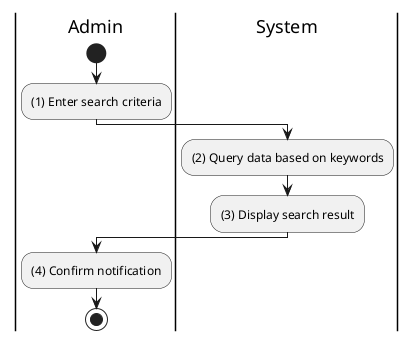

# Activity Search Document

```plantuml
@startuml
|A|Admin
|S|System

|A|
start
:(1) Enter search criteria;
|S|
:(2) Query data based on keywords;
:(3) Display search result;
|A|
:(4) Confirm notification;
stop
@enduml
```

<!-- diagram id="activity-adjust-document-search-document" -->
