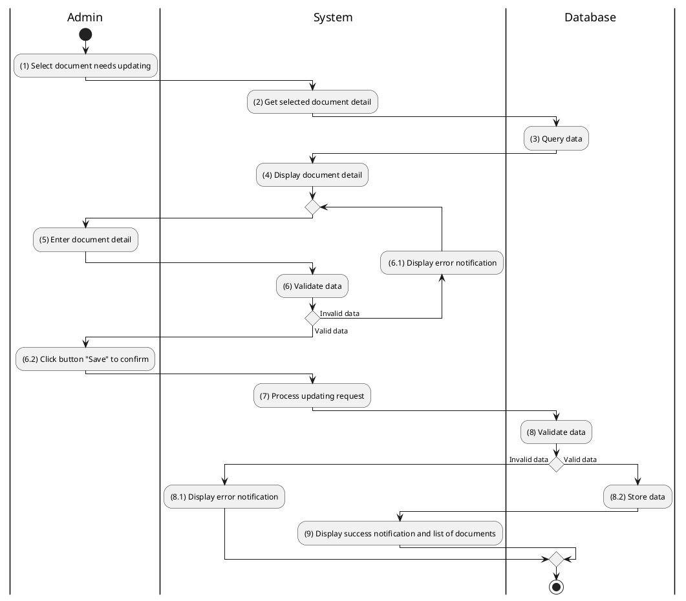

# Activity Update Document

```plantuml
@startuml
|A|Admin
|S|System
|D|Database

|A|
start
:(1) Select document needs updating;
|S|
:(2) Get selected document detail;
|D|
:(3) Query data;
|S|
:(4) Display document detail;
repeat
  |A|
  :(5) Enter document detail;
  |S|
  :(6) Validate data;
backward: (6.1) Display error notification;
repeat while () is (Invalid data) not (Valid data)
|A|
:(6.2) Click button "Save" to confirm;
|S|
:(7) Process updating request;
|D|
:(8) Validate data;
if () then (Invalid data)
  |S|
  :(8.1) Display error notification;
else (Valid data)
  |D|
  :(8.2) Store data;
  |S|
  :(9) Display success notification and list of documents;
endif
|D|
stop

@enduml
```

<!-- diagram id="activity-adjust-document-update-document" -->
