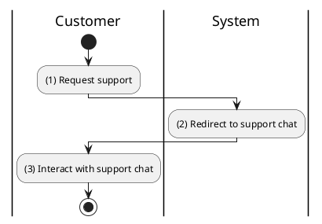

# Activity Contact Support

```plantuml
@startuml
|C|Customer
|S|System

|C|
start
:(1) Request support;
|S|
:(2) Redirect to support chat;
|C|
:(3) Interact with support chat;
stop
@enduml
```

<!-- diagram id="activity-contact-support-contact-support" -->