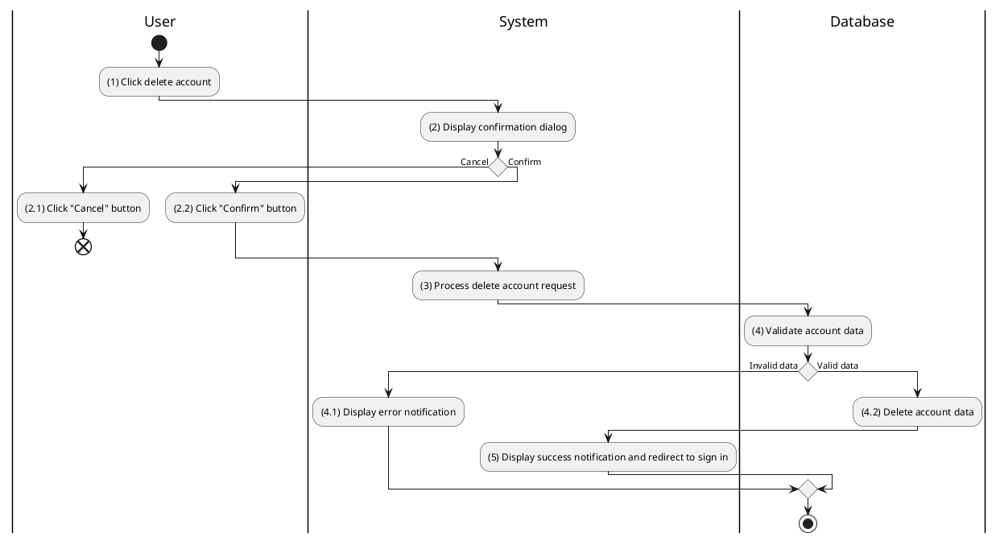

# Activity Delete Account

```plantuml
@startuml
|U|User
|S|System
|D|Database

|U|
start
:(1) Click delete account;
|S|
:(2) Display confirmation dialog;
if () then (Cancel)
  |U|
  :(2.1) Click "Cancel" button;
  end
else (Confirm)
  :(2.2) Click "Confirm" button;
endif
|S|
:(3) Process delete account request;
|D|
:(4) Validate account data;
if () then (Invalid data)
  |S|
  :(4.1) Display error notification;
else (Valid data)
  |D|
  :(4.2) Delete account data;
  |S|
  :(5) Display success notification and redirect to sign in;
endif
|D|
stop

@enduml
```

<!-- diagram id="activity-manage-account-delete-account" -->