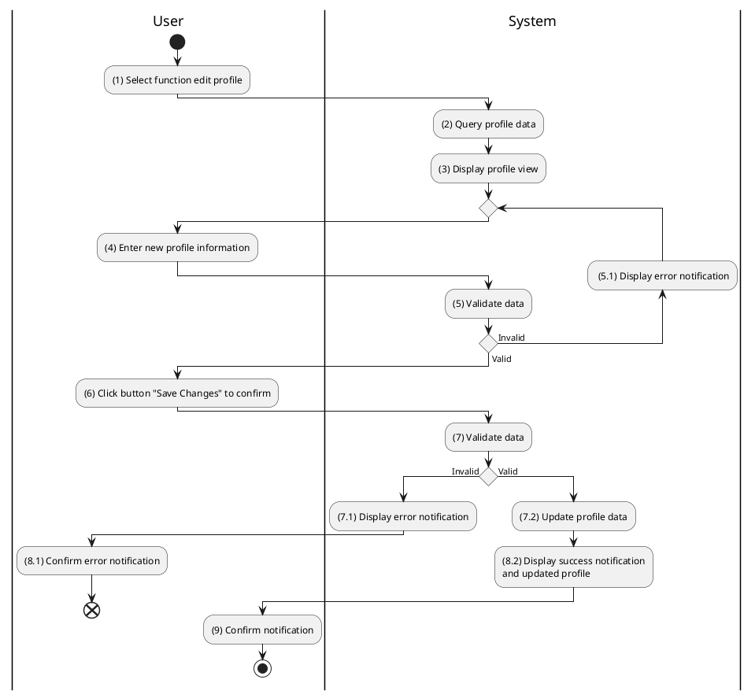

# Activity Edit Profile

```plantuml
@startuml
|U|User
|S|System

|U|
start
:(1) Select function edit profile;
|S|
:(2) Query profile data;
:(3) Display profile view;
repeat
  |U|
  :(4) Enter new profile information;
  |S|
  :(5) Validate data;
backward: (5.1) Display error notification;
repeat while () is (Invalid) not (Valid)
|U|
:(6) Click button "Save Changes" to confirm;
|S|
:(7) Validate data;
if () then (Invalid)
  :(7.1) Display error notification;
  |U|
  :(8.1) Confirm error notification;
  end
else (Valid)
  |S|
  :(7.2) Update profile data;
  :(8.2) Display success notification 
and updated profile;
  |U|
  :(9) Confirm notification;
  stop
endif
@enduml
```

<!-- diagram id="activity-manage-account-edit-profile" -->