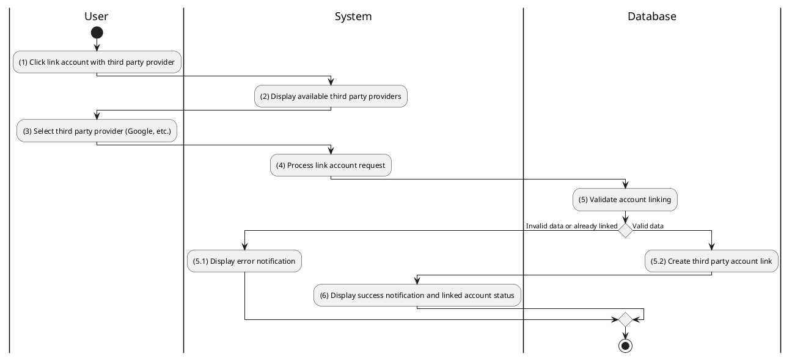

# Activity Link Account With Third Party

```plantuml
@startuml
|U|User
|S|System
|D|Database

|U|
start
:(1) Click link account with third party provider;
|S|
:(2) Display available third party providers;
|U|
:(3) Select third party provider (Google, etc.);
|S|
:(4) Process link account request;
|D|
:(5) Validate account linking;
if () then (Invalid data or already linked)
  |S|
  :(5.1) Display error notification;
else (Valid data)
  |D|
  :(5.2) Create third party account link;
  |S|
  :(6) Display success notification and linked account status;
endif
|D|
stop

@enduml
```

<!-- diagram id="activity-manage-account-link-account-with-third-party" -->