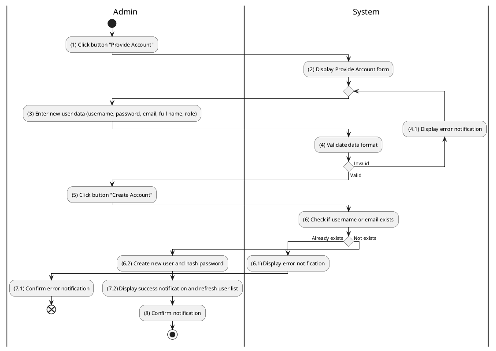

# Activity Provide Account

```plantuml
@startuml
|A|Admin
|S|System

|A|
start
:(1) Click button "Provide Account";
|S|
:(2) Display Provide Account form;
repeat
  |A|
  :(3) Enter new user data (username, password, email, full name, role);
  |S|
  :(4) Validate data format;
backward: (4.1) Display error notification;
repeat while () is (Invalid) not (Valid)
|A|
:(5) Click button "Create Account";
|S|
:(6) Check if username or email exists;
if () then (Already exists)
  :(6.1) Display error notification;
  |A|
  :(7.1) Confirm error notification;
  end
else (Not exists)
  :(6.2) Create new user and hash password;
  :(7.2) Display success notification and refresh user list;
  |A|
  :(8) Confirm notification;
  stop
endif
@enduml
```

<!-- diagram id="activity-manage-account-provide-account" -->
