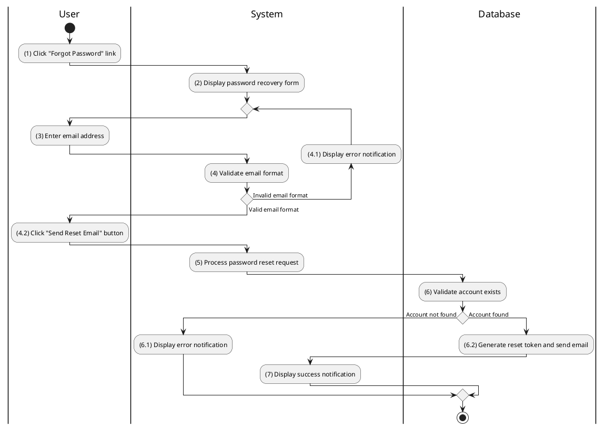

# Activity Recover Account

```plantuml
@startuml
|U|User
|S|System
|D|Database

|U|
start
:(1) Click "Forgot Password" link;
|S|
:(2) Display password recovery form;
repeat
  |U|
  :(3) Enter email address;
  |S|
  :(4) Validate email format;
backward: (4.1) Display error notification;
repeat while () is (Invalid email format) not (Valid email format)
|U|
:(4.2) Click "Send Reset Email" button;
|S|
:(5) Process password reset request;
|D|
:(6) Validate account exists;
if () then (Account not found)
  |S|
  :(6.1) Display error notification;
else (Account found)
  |D|
  :(6.2) Generate reset token and send email;
  |S|
  :(7) Display success notification;
endif
|D|
stop

@enduml
```

<!-- diagram id="activity-manage-account-recover-account" -->