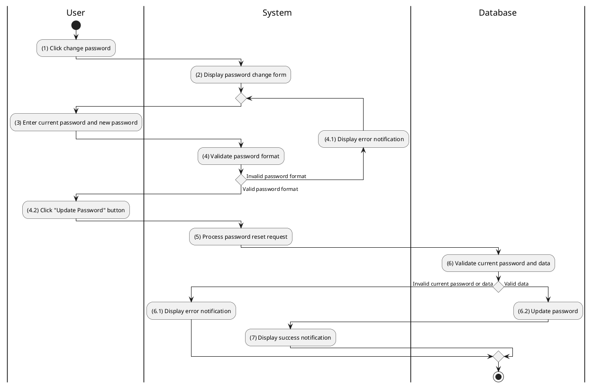

# Activity Reset Password

```plantuml
@startuml
|U|User
|S|System
|D|Database

|U|
start
:(1) Click change password;
|S|
:(2) Display password change form;
repeat
  |U|
  :(3) Enter current password and new password;
  |S|
  :(4) Validate password format;
backward: (4.1) Display error notification;
repeat while () is (Invalid password format) not (Valid password format)
|U|
:(4.2) Click "Update Password" button;
|S|
:(5) Process password reset request;
|D|
:(6) Validate current password and data;
if () then (Invalid current password or data)
  |S|
  :(6.1) Display error notification;
else (Valid data)
  |D|
  :(6.2) Update password;
  |S|
  :(7) Display success notification;
endif
|D|
stop

@enduml
```

<!-- diagram id="activity-manage-account-reset-password" -->