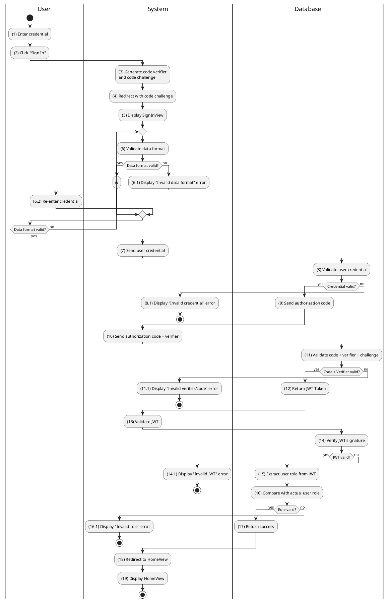

# Activity Sign In

```plantuml
@startuml
|User|
start
:(1) Enter credential;
:(2) Click "Sign In";

|System|
:(3) Generate code verifier\nand code challenge;
:(4) Redirect with code challenge;
:(5) Display SignInView;

repeat
  :(6) Validate data format;
  if (Data format valid?) then (yes)
    --
  else (no)
    :(6.1) Display "Invalid data format" error;
    |User|
    :(6.2) Re-enter credential;
  endif
repeat while (Data format valid?) is (no) not (yes)

|System|
:(7) Send user credential;

|Database|
:(8) Validate user credential;
if (Credential valid?) then (yes)
  :(9) Send authorization code;
else (no)
  |System|
  :(8.1) Display "Invalid credential" error;
  stop
endif

|System|
:(10) Send authorization code + verifier;

|Database|
:(11) Validate code + verifier + challenge;
if (Code + Verifier valid?) then (yes)
  :(12) Return JWT Token;
else (no)
  |System|
  :(11.1) Display "Invalid verifier/code" error;
  stop
endif

|System|
:(13) Validate JWT;

|Database|
:(14) Verify JWT signature;
if (JWT valid?) then (yes)
  :(15) Extract user role from JWT;
  :(16) Compare with actual user role;
  if (Role valid?) then (yes)
    :(17) Return success;
  else (no)
    |System|
    :(16.1) Display "Invalid role" error;
    stop
  endif
else (no)
  |System|
  :(14.1) Display "Invalid JWT" error;
  stop
endif

|System|
:(18) Redirect to HomeView;
:(19) Display HomeView;

stop
@enduml
```

<!-- diagram id="activity-manage-account-sign-in" -->
