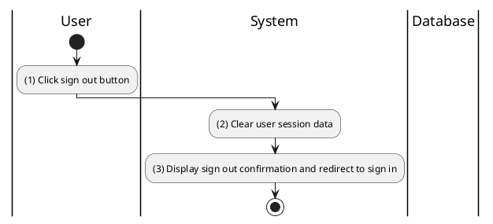

# Activity Sign Out

```plantuml
@startuml
|U|User
|S|System
|D|Database

|U|
start
:(1) Click sign out button;
|S|
:(2) Clear user session data;
:(3) Display sign out confirmation and redirect to sign in;
stop

@enduml
```

<!-- diagram id="activity-manage-account-sign-out" -->