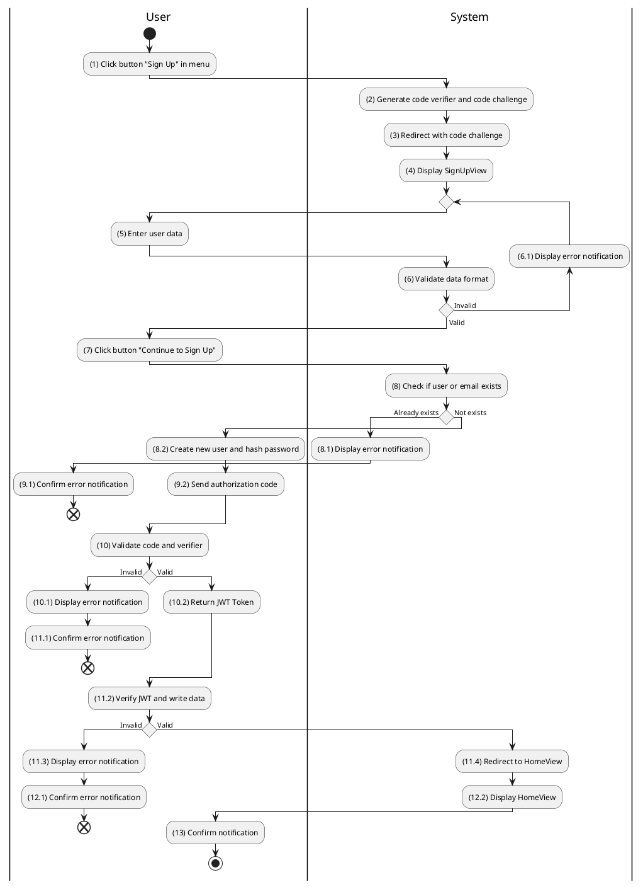

# Activity Sign Up

```plantuml
@startuml
|U|User
|S|System

|U|
start
:(1) Click button "Sign Up" in menu;
|S|
:(2) Generate code verifier and code challenge;
:(3) Redirect with code challenge;
:(4) Display SignUpView;
repeat
  |U|
  :(5) Enter user data;
  |S|
  :(6) Validate data format;
backward: (6.1) Display error notification;
repeat while () is (Invalid) not (Valid)
|U|
:(7) Click button "Continue to Sign Up";
|S|
:(8) Check if user or email exists;
if () then (Already exists)
  :(8.1) Display error notification;
  |U|
  :(9.1) Confirm error notification;
  end
else (Not exists)
  :(8.2) Create new user and hash password;
  :(9.2) Send authorization code;
endif
:(10) Validate code and verifier;
if () then (Invalid)
  :(10.1) Display error notification;
  |U|
  :(11.1) Confirm error notification;
  end
else (Valid)
  :(10.2) Return JWT Token;
endif
:(11.2) Verify JWT and write data;
if () then (Invalid)
  :(11.3) Display error notification;
  |U|
  :(12.1) Confirm error notification;
  end
else (Valid)
  |S|
  :(11.4) Redirect to HomeView;
  :(12.2) Display HomeView;
  |U|
  :(13) Confirm notification;
  stop
endif
@enduml
```

<!-- diagram id="activity-manage-account-sign-up" -->
