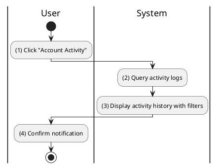

# Activity View Account Activity

```plantuml
@startuml
|U|User
|S|System

|U|
start
:(1) Click "Account Activity";
|S|
:(2) Query activity logs;
:(3) Display activity history with filters;
|U|
:(4) Confirm notification;
stop
@enduml
```

<!-- diagram id="activity-manage-account-view-account-activity" -->
