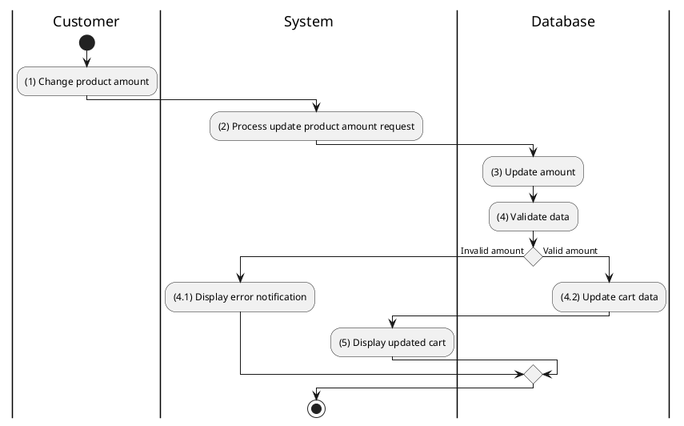

# Activity Change Product Amount

```plantuml
@startuml
|C|Customer
|S|System
|D|Database

|C|
start
:(1) Change product amount;
|S|
:(2) Process update product amount request;
|D|
:(3) Update amount;
:(4) Validate data;
if () then (Invalid amount)
  |S|
  :(4.1) Display error notification;
else (Valid amount)
  |D|
  :(4.2) Update cart data;
  |S|
  :(5) Display updated cart;
endif
stop

@enduml
```

<!-- diagram id="activity-manage-cart-change-product-amount" -->