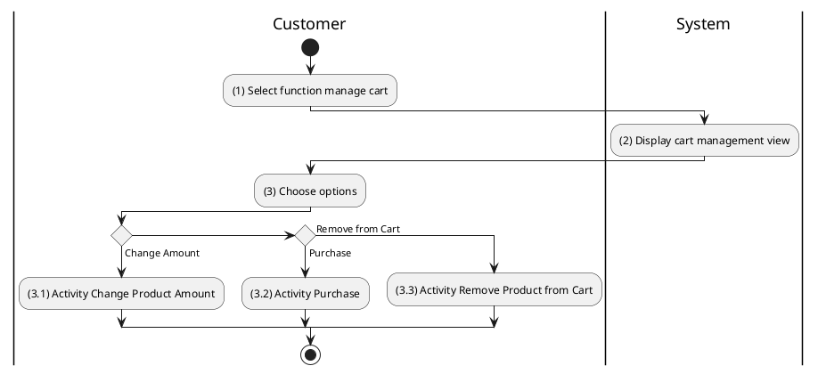

# Activity Manage Cart

```plantuml
@startuml
|C|Customer
|S|System

|C|
start
:(1) Select function manage cart;
|S|
:(2) Display cart management view;
|C|
:(3) Choose options;
if () then (Change Amount)
  :(3.1) Activity Change Product Amount;
elseif () then (Purchase)
  :(3.2) Activity Purchase;
else (Remove from Cart)
  :(3.3) Activity Remove Product from Cart;
endif
|C|
stop
@enduml
```

<!-- diagram id="activity-manage-cart-manage-cart" -->