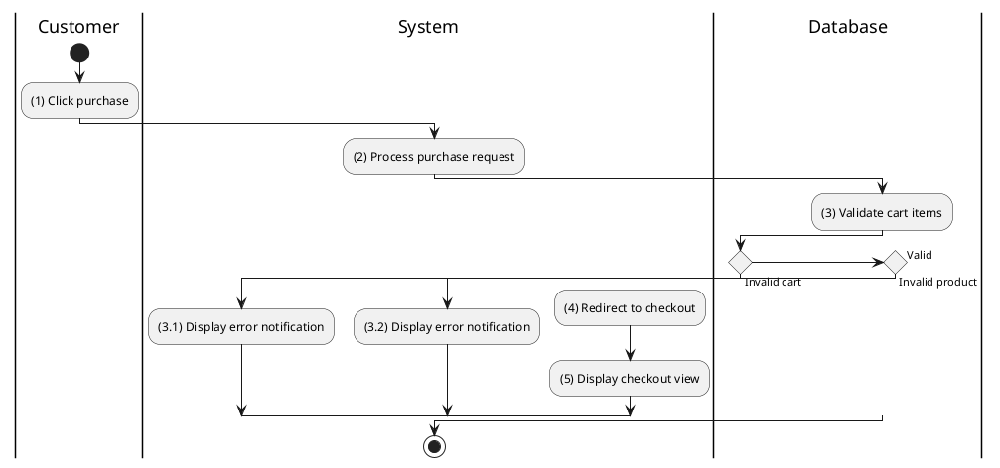

# Activity Purchase

```plantuml
@startuml
|C|Customer
|S|System
|D|Database

|C|
start
:(1) Click purchase;
|S|
:(2) Process purchase request;
|D|
:(3) Validate cart items;
if () then (Invalid cart)
  |S|
  :(3.1) Display error notification;
elseif () then (Invalid product)
  |S|
  :(3.2) Display error notification;
else (Valid)
  |S|
  :(4) Redirect to checkout;
  :(5) Display checkout view;
endif
stop

@enduml
```

<!-- diagram id="activity-manage-cart-purchase" -->
