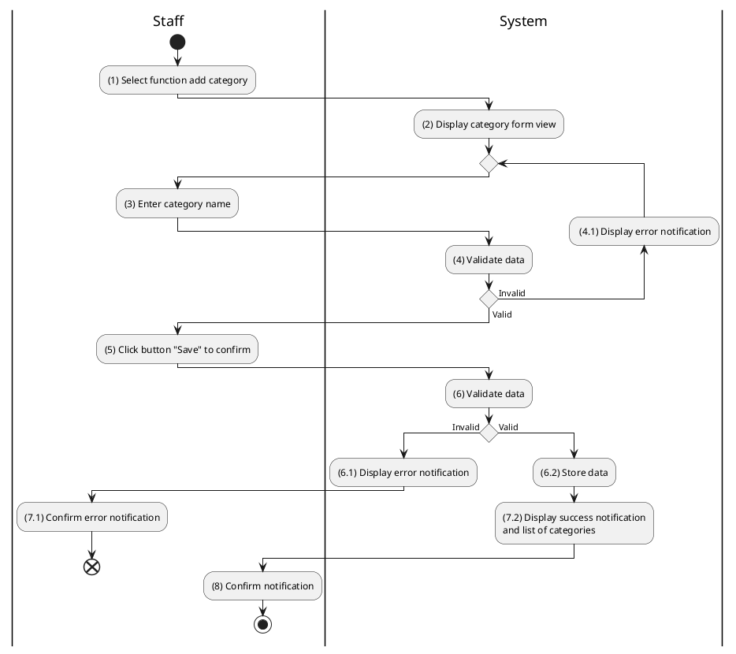

# Activity Add Category

```plantuml
@startuml
|St|Staff
|S|System

|St|
start
:(1) Select function add category;
|S|
:(2) Display category form view;
repeat
  |St|
  :(3) Enter category name;
  |S|
  :(4) Validate data;
backward: (4.1) Display error notification;
repeat while () is (Invalid) not (Valid)
|St|
:(5) Click button "Save" to confirm;
|S|
:(6) Validate data;
if () then (Invalid)
  :(6.1) Display error notification;
  |St|
  :(7.1) Confirm error notification;
  end
else (Valid)
  |S|
  :(6.2) Store data;
  :(7.2) Display success notification
and list of categories;
  |St|
  :(8) Confirm notification;
  stop
endif
@enduml
```

<!-- diagram id="activity-manage-product-add-category" -->
