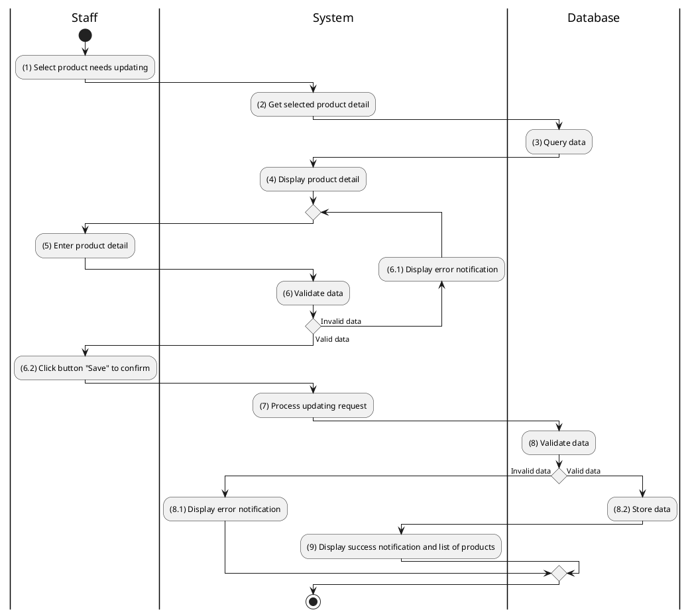

# Activity Update Product

```plantuml
@startuml
|St|Staff
|S|System
|D|Database

|St|
start
:(1) Select product needs updating;
|S|
:(2) Get selected product detail;
|D|
:(3) Query data;
|S|
:(4) Display product detail;
repeat
  |St|
  :(5) Enter product detail;
  |S|
  :(6) Validate data;
backward: (6.1) Display error notification;
repeat while () is (Invalid data) not (Valid data)
|St|
:(6.2) Click button "Save" to confirm;
|S|
:(7) Process updating request;
|D|
:(8) Validate data;
if () then (Invalid data)
  |S|
  :(8.1) Display error notification;
else (Valid data)
  |D|
  :(8.2) Store data;
  |S|
  :(9) Display success notification and list of products;
endif
stop

@enduml
```

<!-- diagram id="activity-manage-product-update-product" -->