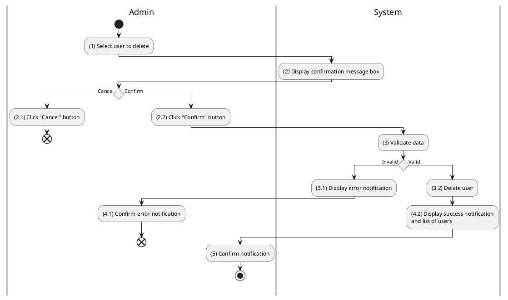

# Activity Delete User

```plantuml
@startuml
|A|Admin
|S|System

|A|
start
:(1) Select user to delete;
|S|
:(2) Display confirmation message box;
|A|
if () then (Cancel)
  :(2.1) Click "Cancel" button;
  end
else (Confirm)
  :(2.2) Click "Confirm" button;
  |S|
  :(3) Validate data;
  if () then (Invalid)
    :(3.1) Display error notification;
    |A|
    :(4.1) Confirm error notification;
    end
  else (Valid)
    |S|
    :(3.2) Delete user;
    :(4.2) Display success notification 
and list of users;
    |A|
    :(5) Confirm notification;
    stop
  endif
endif
@enduml
```

<!-- diagram id="activity-manage-user-delete-user" -->
