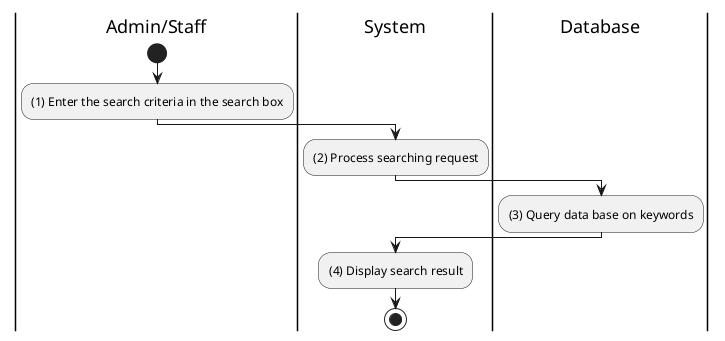

# Activity Search User

```plantuml
@startuml
|AS|Admin/Staff
|S|System
|D|Database

|AS|
start
:(1) Enter the search criteria in the search box;
|S|System
:(2) Process searching request;
|D|
:(3) Query data base on keywords;
|S|
:(4) Display search result;
stop

@enduml
```

<!-- diagram id="activity-manage-user-search-user" -->
