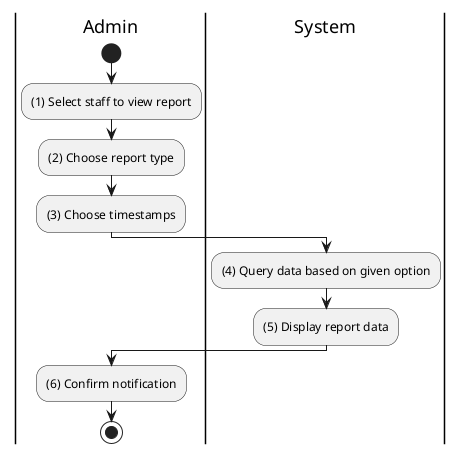

# Activity View Staff Report

```plantuml
@startuml
|A|Admin
|S|System

|A|
start
:(1) Select staff to view report;
:(2) Choose report type;
:(3) Choose timestamps;
|S|
:(4) Query data based on given option;
:(5) Display report data;
|A|
:(6) Confirm notification;
stop
@enduml
```

<!-- diagram id="activity-manage-user-view-staff-report" -->