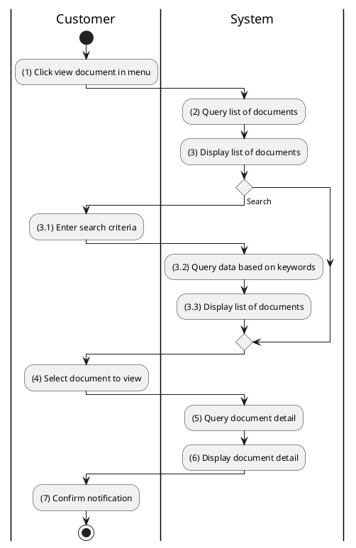

# Activity View Document

```plantuml
@startuml
|C|Customer
|S|System

|C|
start
:(1) Click view document in menu;
|S|
:(2) Query list of documents;
:(3) Display list of documents;
if () then (Search)
  |C|
  :(3.1) Enter search criteria;
  |S|
  :(3.2) Query data based on keywords;
  :(3.3) Display list of documents;
endif
|C|
:(4) Select document to view;
|S|
:(5) Query document detail;
:(6) Display document detail;
|C|
:(7) Confirm notification;
stop
@enduml
```

<!-- diagram id="activity-view-document-view-document" -->