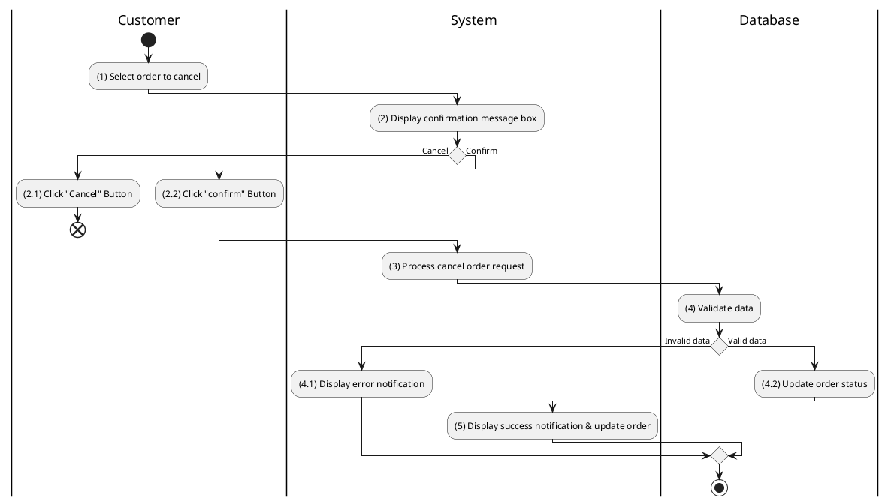

# Activity Cancel Order

```plantuml
@startuml
|C|Customer
|S|System
|D|Database

|C|
start
:(1) Select order to cancel;
|S|
:(2) Display confirmation message box;
if () then (Cancel)
  |C|
  :(2.1) Click "Cancel" Button;
  end
else (Confirm)
  :(2.2) Click "confirm" Button;
endif
|S|
:(3) Process cancel order request;
|D|
:(4) Validate data;
if () then (Invalid data)
  |S|
  :(4.1) Display error notification;
else (Valid data)
  |D|
  :(4.2) Update order status;
  |S|
  :(5) Display success notification & update order;
endif
|D|
stop

@enduml
```

<!-- diagram id="activity-view-order-cancel-order" -->