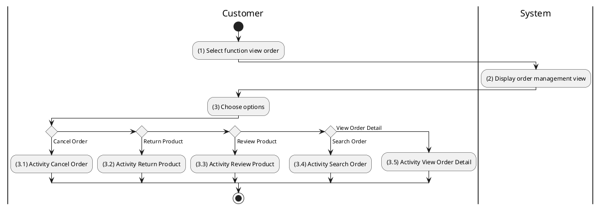

# Activity View Order

```plantuml
@startuml
|C|Customer
|S|System

|C|
start
:(1) Select function view order;
|S|
:(2) Display order management view;
|C|
:(3) Choose options;
if () then (Cancel Order)
  :(3.1) Activity Cancel Order;
elseif () then (Return Product)
  :(3.2) Activity Return Product;
elseif () then (Review Product)
  :(3.3) Activity Review Product;
elseif () then (Search Order)
  :(3.4) Activity Search Order;
else (View Order Detail)
  :(3.5) Activity View Order Detail;
endif
|C|
stop
@enduml
```

<!-- diagram id="activity-view-order-view-order" -->