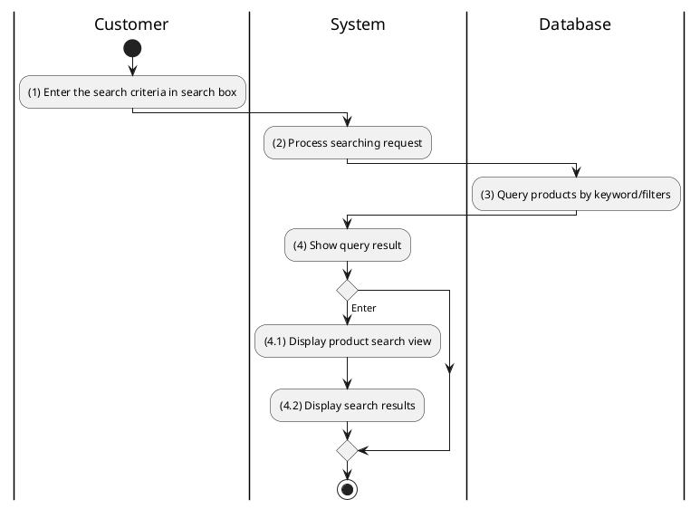

# Activity Search Product

```plantuml
@startuml
|C|Customer
|S|System
|D|Database

|C|
start
:(1) Enter the search criteria in search box;
|S|
:(2) Process searching request;
|D|
:(3) Query products by keyword/filters;
|S|
:(4) Show query result;
if () then (Enter)
  :(4.1) Display product search view;
  :(4.2) Display search results;
endif
stop

@enduml
```

<!-- diagram id="activity-view-product-search-product" -->
