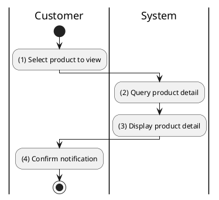

# Activity View Product Detail

```plantuml
@startuml
|C|Customer
|S|System

|C|
start
:(1) Select product to view;
|S|
:(2) Query product detail;
:(3) Display product detail;
|C|
:(4) Confirm notification;
stop
@enduml
```

<!-- diagram id="activity-view-product-view-product-detail" -->
